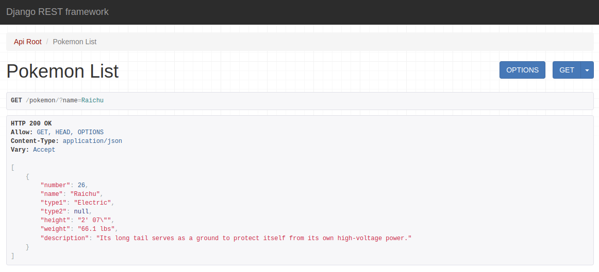

# PokeAPI
This is a simple Django read-only REST API for the original 151 Pokemon.  It uses [Django REST framework](https://www.django-rest-framework.org/).  I wrote a small script (get-poke-data.py) that uses requests and BeautifulSoup to scrape the Pokemon data for the database.

## Requirements

- [Python >= 3.6](https://www.python.org/)
- [Requests](https://docs.python-requests.org/en/latest/)
- [BeautifulSoup](https://www.crummy.com/software/BeautifulSoup/bs4/doc/)
- [Django](https://www.djangoproject.com/)
- [Django REST framework](https://www.django-rest-framework.org/)

## Installing

1. Create a Python virtual environment for the project: `python3 -m venv path/to/env`
2. Activate the environment: `. path/to/env/bin/activate`
3. Upgrade pip and install dependencies: `pip install --upgrade pip && pip install requests bs4 django djangorestframework`
4. Clone the repository: `git clone https://github.com/ghbhc/PokeAPI.git && cd PokeAPI`
5. Migrate: `./manage.py migrate`
6. Run get-poke-data.py script to populate database: `./manage.py shell < get-poke-data.py`

## Running

Run the server and have fun!

`./manage.py runserver 127.0.0.1:8000`

## Examples

### return the whole query set

### filtering by name

